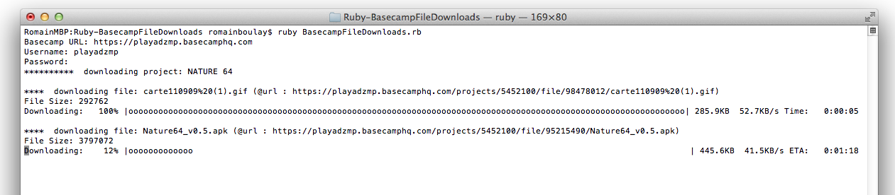
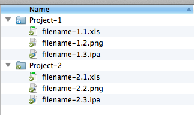

Ruby-BasecampFileDownloads
==========================

A ruby script to download all files from your Classic Basecamp account

Install
-------------

    bundle install

Launch
-------------

	ruby BasecampFileDownloads

Then follow the prompt :

Result
-------------

Licence
-------------

Released under the [MIT license](http://opensource.org/licenses/MIT "MIT license")
